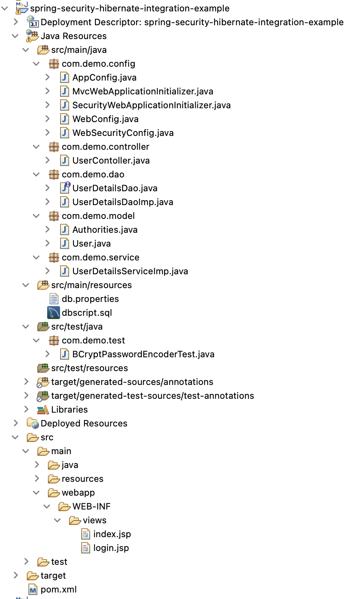
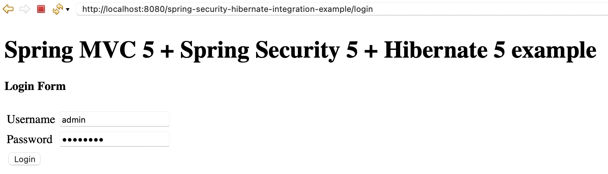
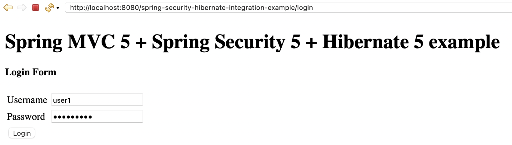
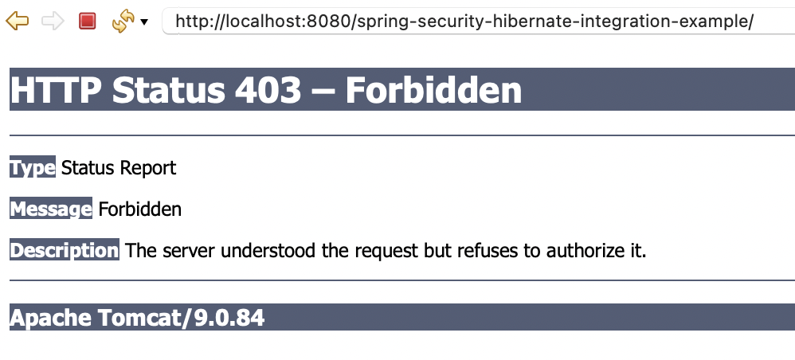

# spring-security-annot-hibernate

This application creates a **Spring Security Custom Login Form with Database Authentication**

## Tools and Technologies Used

-   Java 8
-   Spring Security 5.0.0.RELEASE
-   Spring ORM 5.0.2.RELEASE
-   Spring MVC 5.0.2.RELEASE
-   Hibernate 5.2.12.Final
-   C3p0 0.9.5.2
-   Tomcat 9 with Servlet 4.0
-   Common Pool 2.1.1
-   Maven 3.9
-   Eclipse Spring Tool Suite4 (STS)
-   MySQL Server 8.x / Oracle 11+
-   JSTL 1.2

## About the Application
- Create a `custom login form` in `Spring MVC application` with `Spring Security`.
- Integrate the `Hibernate` with `Spring security framework` to load the user’s authentication.
- Use the `UserDetailsService interface` to load the user’s authentication information from a database.
- `Encode the password` before inserting into database

## Project Structure: Spring MVC 5 + Spring Security 5 + Annotation + Hibernate 5 + Custom Login Form

## DEMO
### 1. Login in as "ADMIN" role

### 2. Successfully logged in

### 3. Login in as "USER" role

### 4. Not authorized error

